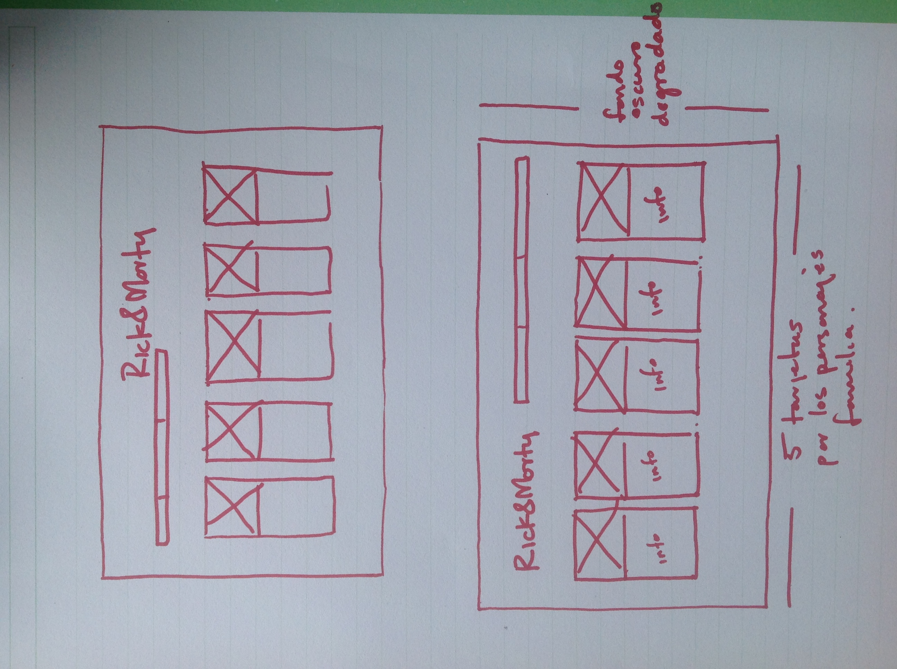
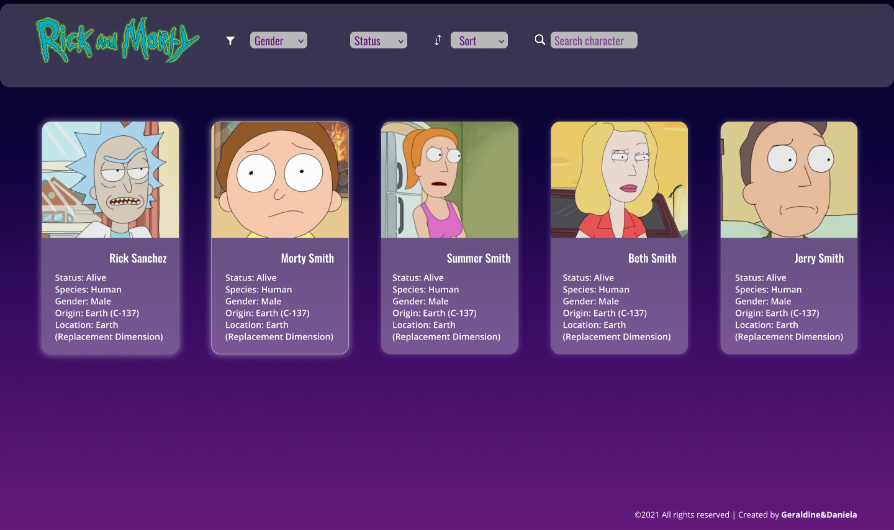
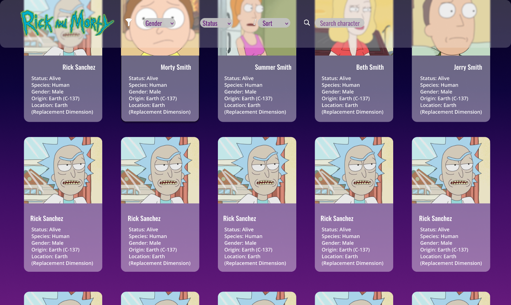

# Data Lovers - Rick & Morty 

## Definición del Producto

El proyecto de Rick & Morty tiene como finalidad mostrar un conjunto de data (personajes) visualizada en tarjetas individuales dentro de una página web que permita al usuario filtrar, acomodar y buscar la misma data.

La página está dirigida a los más grandes fans de la serie; un público milennial en su mayoría masculino, donde través de una investigación se determinó que los datos más relevantes a mostrar en cada tarjeta serían: *Nombre, estado, especie, género, origen y localización.*

El usuario hará uso de ésta página cuando quiera informarse de ciertos datos que desconoce sobre ciertos personajes, donde la interfaz amigable permite encontrar lo que se busca facilmente.

## Historias de Usuario

**HISTORIA DE USUARIO 1**
    *Yo como:* súper fan de Rick&Morty
    *quiero:* ver los personajes principales en el inicio
    *para:* buscar su información de inmediato

*Criterios de aceptación*
    ● En el inicio de la interfaz aparezcan los nombres de los personajes principales y su información
    ● Mostrar imagen del personaje arriba de la informacion
    ● El diseño debe ser responsive: web y movil
    
*Definición de terminado*
    ● Haber usado la data importada del archivo .js
    ● Se puede iterar la información con el algortimo usado
    ● Que ambas entendamos el código implementado
    ● Recibir feedback del avance
    
**HISTORIA DE USUARIO 2**
    *Yo como:* fan de la serie
    *quiero:* ver un menú de opciones
    *para:* ver otras opciones de búsqueda de personajes y ordenar alfabéticamente 

 *Criterios de aceptación*
    ● Se puede filtrar búsqueda por distintas categorías: género, estado o cruzado
    ● Se puede ordernar los personajes por orden alfabético y viceversa
    ● Se puede hacer búsqueda por personaje
    
*Definición de terminado*
    ● Arreglar desperfectos del grid en la interfaz
    ● Recibir feedback del avance
    ● Modificar el menú de opciones
    ● Comenzar a definir el testing

**HISTORIA DE USUARIO 3**  
    *Yo como:* fan de la serie
    *quiero:* mostrar mi filtrado como álbum  
    *para:* visualizar de manera efectiva

 *Criterios de aceptación*
    ● El usuario puede regresar a la página de inicio dando click sobre el logo
    ● El menú está estático en pantalla al hacer scrolling (excepto en pantallas pequeñas)
    
*Definición de terminado*
    ● Pasa todos los test definidos previamente
    ● Se ha recibido feedback sobre su uso
       
    
## Prototipo de baja fidelidad

## Prototipo de alta fidelidad 

## Link Zeplin

   » https://scene.zeplin.io/project/611556e9aa4ae399702c6331

## Problemas detectado a través de test de usabilidad 
 
 ● Tamaño de las tarjetas era un poco pequeño para su debida legibilidad
 ● El diseño del menú estaba un poco disperso y no tan integrado al diseño general del header
